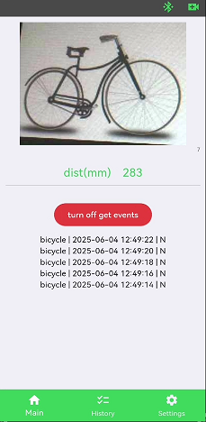

# GRC AI-Cam Development Board example

The example is designed to be run on the GRC AI-Cam development board and is intended to demonstrate \
the functionality of the board. The structural diagram of the modules, included in this board, is shown in the figure 1 below. \
\
figure 1 \
 
\
The example allows you to use the following functionality:

* receiving information from the camera, processing data by the HX6538 microcontroller and accelerators to form images in YUV, RGB and JPEG formats.

* search for specific objects in images and classifying them using a neural network, running on the Ethos-U55 accelerator, which is a part of the HX6538 microcontroller.

* sending images from the camera and results of object classification to an external TFT panel (SPI interface is used), or transmit them \
to the nRF52833 microcontroller (SPI is also used) for saving and retransmission via Bluetooth to a smartphone.

* activation the HX6538 microcontroller and start data processing by external events – an appearance of objects in the Time-Of-Flight sensor visibility zone.

The Open-Source YOLOv8n model is used as a neural network model in this example. The model is pre-compiled by the Ethos-U Vela compiler and the Ethos-U55 accelerator\
is used for data processing.

The user can to use his own neural network in the project, instead of the one offered by default. We will provide the instructions  on how to replace the neural network model, \
pre-processing and post-processing procedures in case another one will be used.

## Scenarios

There are three possible work scenarios.

### Scenario 1

The HX6538 microcontroller is always on. The camera image and the result of data processing (inference) are displayed on the external TFT panel. \
The nRF52833 microcontroller is not used in this scenario except to power up the Himax. It is most suitable scenario for debugging custom neural networks.


### Scenario 2

This mode uses the Time-Of-Flight sensor that periodically measures the distance to an object. It is autonomous mode and an object is expected to appear in the visibility \
zone. When an object is detected, the HX6538 microcontroller is powered on and a series of neural network operations (inferences) are launched. After a specified period \
of time, the HM6538 microcontroller turns off. Then the device waits for disappearance of the object. After this, when no objects are in the visibility zone, device is put \
to the autonomous mode again and waits for the next event, this algorithm is repeated continuously. The image from the camera and the result of data processing are \
displayed on the TFT panel, as well as in the first scenario. The scenario is intended for prototyping energy-efficient devices, that can have autonomous battery power supply \
and should be turned on by an external event for a short period of time.

### Scanario 3

In this mode, it is possible to output camera images and recognition results to user's smartphone via Bluetooth interface. TFT panel is not used here and \
not connected. The SPI interface is used to transfer data between HX6538 and nRF52833 microcontrollers. When there are not any external Bluetooth connections, \
device is in autonomous mode. The time-of-flight sensor turns on periodically and measures the distance. An object is expected to appear in the visibility zone. \
The HX6538 is powered off. After the sensor is triggered, the power of the HX6538 turns on and a specified number of neural network operations (inferences) are produced. \
The results are sent to the nRF52833 for storage. When connecting a smartphone to the device via Bluetooth, it is possible to capture and view images from the camera \
on the screen of the smartphone and to read the history of operations (inferences). By the special set of command the device can be lunched to make inferences \
continuously and user can examine the results of the operations. The time-of-flight sensor can be also turned on in continuous mode and the results of the measurements \
will be shown on the screen  of the smartphone. Once the connection is complete, the device will switch to autonomous mode after specified period of time.

## Preparing the device for operation

### The location of the main controls of the GRC AI-Cam board

The location of the main controls used in the proposed Demonstration  Project, is shown in Figure 2.

\
figure 2 \


The purpose of the buttons and connectors is shown below.

| Button      | Function                                                   |
| :---------- |----------------------------------------------------------- |
|    SW1      | HM6538 reset                                               |
|    SW2      | Enter bootloder mode or User Button                        |

| Connector   | Function                                                   |
| :---------- |----------------------------------------------------------- |
|    J2       | Auxiliary connector                                        |
|             | pin 1 -> HM6538 PB1 pin (Uart Tx)                          |
|             | pin 2 -> HM6538 SEN_I2CM_SCL pin (I2C SCL)                 |
|             | pin 3 -> HM6538 PB0 pin (Uart Rx)                          |
|             | pin 4 -> HM6538 SEN_I2CM_SDA pin (I2C SDA)                 |
|             | pin 5 -> nRF52833 P0.26 pin                                |
|             | pin 6 -> nRF52833 P0.6 pin                                 |
|             | pin 7 -> nRF52833 P1.1 pin                                 |
|             | pin 8 -> nRF52833 P0.9 pin                                 |
|             | pin 9 -> GND                                               |
|             | pin 10 -> Vcc (The output level translator power 1.65..5V) |

| Connector   | Function                                          |
| :---------- |-------------------------------------------------- |
|    J5       | MIPI camera connector (the CV5647 sensor is used) |

| Connector   | Function        |
| :---------- |---------------- |
|    J7       | Power connector |
|             | pin 1 -> VBUS   |
|             | pin 2 -> GND    |

| Connector   | Function                                                   |
| :---------- |----------------------------------------------------------- |
|    J8       | USB type C connector                                       |
|             | (bootloaders of both chips use this connector)             |

In case when external TFT display is involved use TP1..TP5 pad for connection, as shown below:

| Pad         | Function    |
| :---------- |------------ |
| TP1         | GND         |
| TP2         | SPI_CLK     |
| TP3         | SPI_CS      |
| TP4         | SPI_DI      |
| TP5         | SPI_DO      |


### How build firmware

The firmware of the device consists of three parts:

* HM6538 microcontroller firmware.
* nRF52833 microcontroller firmware.
* Android software

In the scenario 1 only the HM6538 firmware part is actual needed, but for scenarios 2 and 3 the nRF52833 firmware part is required too. \
In case of the scenario 3, the smartphone must have Android software installed.

#### The repository structure

All the source code required to build the HM6538 and nRF52833 software, is contained in this repository. It includes C sources code \
for application, libraries and drivers, projects configurations, as well as some necessary utilities and binary libraries. The utilities \
include programming tools, that you can use to flash original and your own firmware to the device. These projects also require some \
external dependencies to build, the installation process for these will be described below.

After cloning the repository, you should have folders organized as follows:

```bash
├── GrcAICam
│   ├── yolo_example
│   │   ├── android
│   │   ├── himax
│   │   ├── images
|   │   ├── nrf
```

The descritions of the directories is presented in the table below:

| Directory                                  | Description                                                      |
| :----------------------------------------- | :--------------------------------------------------------------- |
| android                                    | The apk file for installation of the Android application         |
| himax                                      | The project and utilities to build and flash HM6538 firmware     |
| images                                     | The set of images,which can be used as reference images (slides) |
| nrf                                        | The project and utilities to build and flash nRF 52833 firmware  |

#### Build HM6538 Firmware on Windows

* To install GNU make, download the file *xpack-windows-build-tools-4.4.1-3-win32-x64.zip* from \
<https://github.com/xpack-dev-tools/windows-build-tools-xpack/releases> \
and extract it to a folder on your computer. Go to *himax* directory, open the *build.bat* file in any text editor \
and replace the value of the *GNU_MAKE_PATH* variable with the actual path to the folder where make is installed \
(*xpack-windows-build-tools-4.4.1-3\bin* default).

* Download and install Arm GNU Toolchain from \
<https://developer.arm.com/downloads/-/arm-gnu-toolchain-downloads/13-3-rel1> \
and add the path to the ARM toolchain to user or system environment variable PATH.

* Clone Seeed_Grove_Vision_AI_Module_V2 repository from \
<https://github.com/HimaxWiseEyePlus/Seeed_Grove_Vision_AI_Module_V2> \
to a folder on your computer. Go to *himax* directory, open the *build.bat* file in any text editor and replace the \
value of the *SGV_INST_PATH* variable with the actual path to the Seeed_Grove_Vision_AI_Module_V2 repository. \
For example, if the repository is installed in the *c:\work* folder, then the value of the variable should be set as follows: \
*set SGV_INST_PATH=c:\work\Seeed_Grove_Vision_AI_Module_V2*.

* Run script *build.bat* and wait for operation is completed.

* When the firmware build is completed, you should have the *himax/build* directory containing *output.img* file.

#### Build HM6538 Firmware on Linux

* To install GNU make, run the following command in terminal:

> sudo apt install make

* Download and install Arm Toolchain:

> cd ~ \
> wget <https://developer.arm.com/-/media/Files/downloads/gnu/13.2.rel1/binrel/arm-gnu-toolchain-13.2.rel1-x86_64-arm-none-eabi.tar.xz> \
tar -xvf arm-gnu-toolchain-13.2.rel1-x86_64-arm-none-eabi.tar.xz \
export PATH="$HOME/arm-gnu-toolchain-13.2.Rel1-x86_64-arm-none-eabi/bin/:$PATH"

* Clone Seeed_Grove_Vision_AI_Module_V2 repository from \
<https://github.com/HimaxWiseEyePlus/Seeed_Grove_Vision_AI_Module_V2> \
to a folder on your computer.

* Go to *himax* directory, open the *build.sh* file in any text editor and replace the value of the *SGV_INST_PATH* variable \
with the actual path to the Seeed_Grove_Vision_AI_Module_V2 repository. For example, if the repository is installed in the \
*/tmp* folder, then the value of the variable should be set as follows: \
*SGV_INST_PATH=/tmp/Seeed_Grove_Vision_AI_Module_V2*.

* Set execute permission to *build.sh* file:

> chmod +x build.sh

* Make sure that the line endings of the *build.sh* file are in UNIX format, otherwise use the *dos2unix* utility to convert:

> dos2unix build.sh


* Run script *build.sh* and wait for operation is completed.

* When the firmware build is completed, you should have the *build* directory containing *output.img* file.

#### Build nRF52833 Firmware on Windows

* Install Visual Studio Code.

* Install the following extensions:
  * nRF Connect for VS Code
  * nRF Connect for VS Code Extension Pack
  * nRF DeviceTree
  * nRF DeviceTree
  * nRF Terminal

* Download and install nRF Connect for Desktop from \
<https://www.nordicsemi.com/Products/Development-tools/nRF-Connect-for-Desktop/Download#infotabs>

* Run nRF Connect for Desktop and install Toolchain Manager application.

* Run Toolchain Manager and install nRF Connect SDK v2.9.0.

* Run Visual Studio Code and open the *nrf* folder.

* Go to nRF Connect (left-click on the icon in the left navigation or press Ctrl+Alt+N).

* In the "application/nrf" tab, left-click on the text "Add build configuration", 
"Build Configuration" selection dialog will appear.

* Make sure the SDK and toolchain versions are correct (2.9.0), then select the nrf52833_aicam/nrf52833 target.

* Check the "Use sysbuild" box at the bottom of the dialog and click the button "Generate and build".

* When the firmware build is completed, you should have the *build\nrf\zephyr* directory containing *zephyr.signed.bin* file. 

#### Build nRF52833 Firmware on Linux

The procedure is basically the same as described in the previous paragraph.

### How flash firmware

The GRC AI-Cam development board comes with pre-flashed bootloaders that, allows both parts of the device to be flashed \
via serial port interfaces, without a need for special programming tools. A common USB-C connector is used to connect to PC \
both parts of the device, Himax and nRF, and the choice of particular device depends on which side the USB-C connector \
is inserted. Serial ports parameters for both devices are shown in the table below:

| Device      | VID    | PID    | Device        |
| :---------- | :----- | :----- | :------------ |
| Himax       | 0x1A86 | 0x55D3 | CH343P        |
| nRF         | 0x2FE3 | 0x0100 | Zephyr        |

#### How to enter bootloader mode

* Disconnect USB-C plug from J8 socket
* Press and hold SW2 button
* Connect USB-C plug
* Release SW2 button

#### Install prerequisites

* Install Python version 3.10 or later. Install pip.
* Move into *himax/flasher* directory and install packages needed to work:

> pip install -r requirements.txt

#### Flashing firmware onto HM6538

For flashing HM6538 you need to do the following steps:

* Install prerequisites.

* Connect USB-C connector on the GRC AI-Cam development board (J8 socket in the figure 2) to your personal computer \
by USB-C cable. Make sure the USB-C connector is inserted correctly and the HM6538 serial port is displayed in Windows \
Device Manager (or use *lsusb* command if You work on Linux to get VID and PID parameters of the serial device).

* Enter bootloader mode as described above.

* *At Windows Environment only*:\
Open the *himax/prog_fw.bat* file in any text editor and replace the value of the *COM_PORT* variable with the name of actual \
serial port, which is already defined in the previous step. Then run script *prog_fw.bat*, follow the instructions in the console \
and wait for operation is completed.

* *At Linux Environment only*: \
Set execute permission to *himax/prog_fw.sh* file. Make sure that the line endings of the *himax/prog_fw.sh* file are in UNIX format. \
Open the *himax/prog_fw.sh* file in any text editor and replace the value of the *TTY_DEV* variable with the name of actual \
tty device, which is already defined in the previous step. Then run script *prog_fw.sh*, follow the instructions in the console \
and wait for operation is completed.

After flashing the HM6538 you should see a message in the terminal as in figure 3:

\
figure 3 \
 

#### Flashing model onto HM6538

Precompiled models are in the models folder. After flashing, models will be stored in QSPI flash memory, and occupy the range \
0x3a200000..3bffffff in the address space. There is a constant in the code *YOLO_TFLITE_ADDR* that defines the base address \
of the model, so the actual base address of the written model must be equal to the value of this constant.

To write a model to the QSPI flash memory, you need to do the following:

* Install prerequisites.

* Connect USB-C connector on the GRC AI-Cam development board (J8 socket in the figure 2) to your personal computer \
by USB-C cable. Make sure the USB-C connector is inserted correctly and the HM6538 serial port is displayed in Windows \
Device Manager (or use *lsusb* command if you work on Linux to get VID and PID parameters of the serial device).

* Enter bootloader mode as described above.

* *At Windows Environment only*: \
Open the *himax/prog_md.bat* file in any text editor and change the value of the following variables: \
*COM_PORT* - the name of actual Himax serial port. \
*MODEL_FILE* - the path and file name of the tflite model. \
*MEM_OFFSET* - the offset of the model in the flash memory. \
For example,if the base address of the model is 0x3a200000, the offset must be 0x200000. \
The run the script *prog_md.bat*, follow the instructions in the console and wait for operation is completed.

* *At Linux Environment only*: \
Set execute permission to *himax/prog_md.sh* file. Make sure that the line endings of the *himax/prog_md.sh* file are in UNIX format. \
Open the *himax/prog_md.sh* file in any text editor and change the value of the following variables: \
*TTY_DEV* - the name of actual Himax serial device. \
*MODEL_FILE* - the path and file name of the tflite model. \
*MEM_OFFSET* - the offset of the model in the flash memory. \
For example,if the base address of the model is 0x3a200000, the offset must be 0x200000. \
The run the script *prog_md.sh*, follow the instructions in the console and wait for operation is completed.

After flashing the model in QSPI flash you will see a message in the terminal as in the figure 4:

\
figure 4 \


#### Flashing firmware onto nRF52833

The GRC-AI-Cam development board uses the *mcuboot* bootloader and the *mcumgr* command-line tool to update the firmware. \
The tool is written in the Go programming language. To install the *mcumgr*, follow the instructions on this site:
<https://docs.nordicsemi.com/bundle/ncs-2.6.3/page/zephyr/services/device_mgmt/mcumgr.html>

After installing *mcumgr* tool you need to follow these steps to flash nRF52833:

* Enter bootloader mode as described above.

* *At Windows Environment only*: \
Open the *nrf/mcumgr_run.bat* file in any text editor and change the value of the *COM_PORT* variable \
set it to the actual name of the nRF serial port. If necessary, use the Windows Device Manager to check \
the VID and PID parameters of the serial port. Run the *nrf/mcumgr_run.bat* script and wait for operation \
is completed.

* *At Linux Environment only*: \
Open the *nrf/mcumgr_run.sh* file in any text editor and change the value of the *TTY_DEV* variable \
set it to the actual name of the nRF serial port. If necessary, use *lsusb* command to check \
the VID and PID parameters of the serial port. Run the *nrf/mcumgr_run.sh* script and wait for operation \
is completed.

After flashing the firmware in nRF52833 you will see a message in the terminal as in the figure 5:

\
figure 5 \


### Replacing the original model with the user's own model

As it has mentioned before, the user can use his own data processing algorithm. \
The application of machine learning algorithms involves a number of subsidiary tasks to be performed \
as well as algorithm execution itself. This example has similar structure and there are three \
stages of the data procesing called preprocessing, invoke and postprocessing. \
All neuro network operations, used In the example, are implemented by the YoloModel class.

#### YoloModel class

\


**Constructor**

_YoloModel::YoloModel(const void* model_addr, uint8_t* arena, size_t arena_size)_

Parameters:

| Parameter        | Description                                                                       |
| :--------------- | :-------------------------------------------------------------------------------- |
| _model_addr_     | Base address of the model in QSPI flash memory.                                   |
|                  |                                                                                   |
| _arena_          | Pointer to a buffer for input, output and intermediate arrays, which is           |
|                  | pre-allocated in memory space.                                                    |
|                  |                                                                                   |
| _arena_size_     | The size of the pre-allocated buffer.                                             |
|                  |                                                                                   |

Return: None.

**Destructor**

_YoloModel::~YoloModel()_

Parameters: None.

Return: None.

**Properties**

_tflite::MicroInterpreter* interpreter_

A pointer to an Interpreter instance, memory for witch is allocated in the constructor.

**Methods**

_int YoloModel::init()_

Parameters: None.

Return error code: \
0-operation was completed successfully. \
-1-operation execution error.

It is the tensors allocator.

_std::vector<Object> invoke(const Image& img)_

Parameters:

| Parameter        | Description                                                                       |
| :--------------- | :-------------------------------------------------------------------------------- |
| _img_            | An instance of the Image class, witch is intended to provide the access to camera |
|                  | data and procedures for their processing                                          |

Return a vector of objects of the class Object (result of classification operation).

The high level function of the data processing. It includes all three stages - preprocessing,
invoke itself and postprocessing.

_virtual void YoloModel::yolo_pre_process(const Image& img)_

Parameters:

| Parameter        | Description                                                                       |
| :--------------- | :-------------------------------------------------------------------------------- |
| _img_            | Look the description of the previous function                                     |


Return: None.

The procedure should provid all the necessary preprocessing algorithms. For the presented example, \
this is the operation to resize the image. The output format of the Image Subsystem of HM6538 microcontroller \
is RGB 320x240 pixels, however, Yolo model, witch is used in Demo Project, implies to have on the input \
RGB Image with resolution 224x224 pixel. Conversion from one resolution to another is performed by this \
procedure.

_virtual std::vector<Object> yolo_post_process()_

Parameters: None

Return: a vector of objects of the class Object (result of classification operation).

The function provides the processing of a model's output after the model has been run. For Demo Project the NMS algorithm \
is used as a post-processing algorithm to filter the predictions of object detectors models.

#### How to use your own model

* Prepare a pre-trained model in tflite format.

* Install Vela compilier by the following command:

> pip install ethos-u-vela 

* Compile your model by the following command

> vela --accelerator-config ethos-u55-64 --config vela_config.ini --system-config My_Sys_Cfg --memory-mode sram_300kb user_model_file_name

Users can set *memory-mode* and *user_model_file_name* parameters according to their requirements. \
The *vela_config.ini* file is in the *himax/model* folder of this repository.

* Write the compiled model to the QSPI flash memory as described above in the *Flashing the model to the HM6538* paragraph.

* Create a C++ class inherited from the YoloModel class and override the virtual functions YoloModel::yolo_post_process and \
YoloModel::yolo_pre_process. All the necessary pre- and post-processing algorithms must be implemented by these functions. 

* Build the user's firmare version and flash it into the HM6538 microcontroller as described above in the *Build HM6538 Firmware ..* \
and *Flashing firmware onto HM6538* paragraphs.

#### How to install an APK file on Android:

* Connect your smartphone to your computer with an USB cable and select the "File Transfer" mode.

* Copy the *android\apk\wild_05_21.apk* file to your smartfon.

* Tap on the APK file icon. Tap the INSTALL button when dialog box appears. Wait for the application will be installed.

## How it works

### Scenarios selector

To select the required scenario, the user needs to edit the make/CMake configuration files.

* To select the HM6538 scenario, open the *himax/app.mk* file in any text editor and set the value of the \
*APPL SCENARIO* variable to the desired scenario number (1,2 or 3):

figure 6 \


* To select the nRF52833 scenario, open the *nrf/CMakeLists.txt* file in any text editor and set the value of the \
*APPL SCENARIO* variable to the desired scenario number (1,2 or 3):

figure 7 \


Don't forget to rebuild and flash both projects after changing the scenario.

### Scenario 1 example

in progress..

### Scenario 2 example

in progress..

### Scenario 3 example

Here is an example of working according to scenario 3:

Test configuration is shown in the figure 8 below.

figure 8 \


An screen of the Android application is shown in the figure 9 below.

figure 9 \


To run the example:

* Build and flash nRf52833 firmware.

* Build and flash Himax firmware.

* Connect a camera to the GRC AI-Cam development board.

* Install Android application on a smartfone.

* Prepare slide-show on the PC,point the camera correctly.

* Run the Android application.

## The Bluetooth exchange protocol

In case of using external control, this device is presented as a NUS (Nordic Uart Service) device and \
there is a special exchange protocol. This protocol is implemented as a set of AT commands, just like \
AT modem devices. This command system is described below and includes a core set of commands, such as \
reading images from a camera and get history, as well as some additional commands that can be used for \
debugging and control tasks.

Bluetooth identifiers used by this device is show in the table below:

| Name                | Function                        | Value                                |
| :------------------ | :------------------------------ | :----------------------------------- |
| UART_SERVICE_UUID   | Nordic UART service UUID        | 6E400001-B5A3-F393-E0A9-E50E24DCCA9E |
|                     |                                 |                                      |
| UART_RX_CHAR_UUID   | TX Characteristic UUID          | 6E400002-B5A3-F393-E0A9-E50E24DCCA9E |
|                     | (sending commands to a device)  |                                      |
| UART_TX_CHAR_UUID   | RX Characteristic UUID          | 6E400003-B5A3-F393-E0A9-E50E24DCCA9E |
|                     | (notification of receiving)     |                                      |

## The AT command description

All commands and responses must end with a newline character (0x0a). The only exceptions are responses \
to the AT&RDIMG and AT&RINEXT commands, which return binary data and do not have a terminating newline character.

The list of the commands, grouped by category,is gived in the tables below.

**Auxiliary commands:**

| Command           | Example of the answer               | Functionality                                        |
| :---------------- | :---------------------------------- | :--------------------------------------------------- |
| AT                | AT                                  | The "AT" string will be returned                     |
| AT^ECHO=[string]  | [string]                            | The echo mode, sent string will be returned          |
| AT^REBOOT         | OK                                  | The nRF device will be rebooted	in two seconds       |

**Commands with device information:**

| Command           | Example of the answer               | Functionality                                        |
| :---------------- | :---------------------------------- | :--------------------------------------------------- |
| AT^SWNVER         | 01.00.00                            | nRF firmware version                                 |
| AT^SWHVER         | 01.00.03                            | Himax firmware version                               |

**Commands for reading images from camera:**

<table>
<thead>
<tr>
<th>Command</th>
<th>Example of the answer</th>
<th>Functionality</th>
</tr>
</thead>
<tbody>
<tr>
<td>AT&IMAGE</td>
<td>OK</td>
<td>Take a snapshot</td>
</tr>
<tr>
<td>AT&RDIMG</td>
<td>#240 b0 b1 b2..b239</td>
<td>Read the first chunk of the image</td>
</tr>
<tr>
<td>AT&RINEXT</td>
<td>#240 b0 b1 b2..b239 or !016 b0 b1 b2..b15</td>
<td>Read the next no last or last chunk of the image</td>
</tr>
</tbody>
</table>

The structure of the responces to the AT&RDIMG and AT&RINEXT commands is: \
byte 0 : '#' - non last fragment, '!' - last fragment \
bytes 1..3 : number of following binary data, it can be 001..240 \
byte 4 and next : the binary data itself
The response dasn't nave any tailing new line symbol.

The reading image procedure is:

1. Send command AT&IMAGE
2. Read jpeg fragments by the command AT&RDIMG and following commands AT&RINEXT, \
merge them to buffer, if we have read last fragment - stop.

**Commands for reading the list of recognized objects:**

<table>
<thead>
<tr>
<th>Command</th>
<th>Example of the answer</th>
<th>Functionality</th>
</tr>
</thead>
<tbody>
<tr>
<td>AT+LRREAD=[count]</td>
<td>person,2025-04-05 00:00:30,N;<br>umbrella,2025-04-06 12:11:33,Y;<br>bench 2025-04-06 12:55:11,N</td>
<td>Return the first chunk of the history</td>
</tr>
<tr>
<td>AT+LRRDNEXT=[count]</td>
<td>The same responce format</td>
<td>Return the next chunk of the history</td>
</tr>
</tbody>
</table>

The [count] parameter can be 1..7 and represents maximum required number of records. \
The structure of the responces to the AT+LRREAD and AT+LRRDNEXT commands is the sequence of records, \
*no more* than the requested parameter [count], each of them in the format [object name][timestamp][flag] where \
[object name] - the name of recognized object \
[timestamp] - date and time of recognition in the format YYYY-MM-DD HH:MM:SS \
[flag] - Y or N, the flag depends on the object was expected or not

The reading history procedure is:

1. Send command AT+LRREAD, read the first chunk of the list

2. Send commands AT+LRRDNEXT repeatedly, each of them will read the next chunk of the history, \
if we have read empty string - stop.

**The TOF sensor commands:**

<table>
<thead>
<tr>
<th>Command</th>
<th>Example of the answer</th>
<th>Functionality</th>
</tr>
</thead>
<tbody>
<tr>
<td>AT&SMODE=[mode]</td>
<td>OK</td>
<td>Set work mode of the TOF sesor</td>
</tr>
<tr>
<td>AT&RDDIST</td>
<td>10,64351<br>0,222</td>
<td>The measurement status and distance</td>
</tr>
</tbody>
</table>

The work mode can be: \
*TIMER* : In this mode, the sensor takes measurements continuously. \
*OFF* : The sensor is turned off in this mode. \
*AUTO+* : The sensor is put into autonomous mode and an interrupt will be generated when an object appears.

The structure of the responces to the AT&RDDIST command is [Measurement status],[Distance to object], where: \
[Measurement status] - It is equal to zero if the last measurement was successful, or an error code otherwise. \
[Distance] - The distance to the object, this value make sence only if the masurement status is zero.

The distance measurement procedure is:

1. Send command AT&SMODE=TIMER for turning on the sensor.

2. Send one or more commands AT&RDDIST to get the measurement results.

**The commands related to date and time:**

<table>
<thead>
<tr>
<th>Command</th>
<th>Example of the answer</th>
<th>Functionality</th>
</tr>
</thead>
<tbody>
<tr>
<td>AT%TIME</td>
<td>[YYYY]-[MM]-[DD] [yy]:[mm]:[ss]<br>(e.c. 2025-01-01 01:03:23)</td>
<td>Get date and time from device</td>
</tr>
<tr>
<td>AT%TIME=[YYYY]-[MM]-[DD] [yy]:[mm]:[ss]<br>(e.c. AT%TIME=2025-01-01 01:03:23)</td>
<td>OK</td>
<td>Set new date and time</td>
</tr>
</tbody>
</table>
